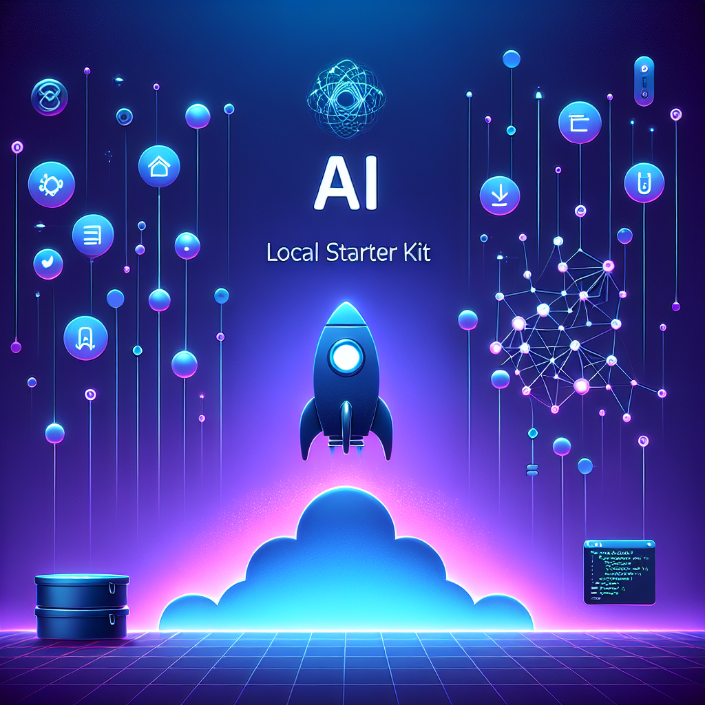

# 🚀 AI Local Starter Kit



[](README_ES.md)

> 🌟 A complete local development environment for artificial intelligence applications, with multiple preconfigured services to create, manage, and deploy AI solutions.

## 📝 Description

AI Local Starter Kit provides a set of AI tools and services configured to work together in a local environment using Docker Compose. This kit facilitates the development, testing, and implementation of AI applications without the need to exclusively rely on cloud services.

## 🧩 Components

The kit includes the following services:

### 🖥️ Interfaces and Development Tools

- **🔄 Flowise** (Port 3001): No-code/low-code tool for building AI agents and workflows.
- **🌐 OpenWebUI** (Port 3000): Web interface for interacting with AI models.
- **⚙️ n8n** (Port 5678): Workflow automation platform.

### 🧠 AI Infrastructure

- **🔌 LiteLLM** (Port 4000): Proxy that simplifies connecting to different AI models.
- **💻 MCPO** (Port 8000):  A proxy that makes MCP servers accessible via standard RESTful OpenAPI, allowing your tools to work seamlessly with LLM agents and applications expecting OpenAPI servers.
- **📄 Docling** (Port 5001): Document management system optimized for AI.
- **🔊 Kokoro-TTS** (Port 8880): Text-to-Speech service optimized for local operation.

### 🗄️ Databases and Support Services

- **💾 PostgreSQL for LiteLLM** (Port 5432): Database for LiteLLM.
- **💾 PostgreSQL for n8n** (Port 5433): Database for n8n.
- **📊 Prometheus** (Port 9090): Monitoring and alerting system.
- **🔄 Watchtower**: Service for automatic container updates.

## 📋 Requirements

- 🐳 Docker and Docker Compose
- 📥 Git (to clone the repository)
- 💻 At least 8GB of available RAM (16GB+ recommended)
- 💽 Disk space for containers and volumes

## ⚙️ Configuration

### 1️⃣ Clone and Initialize

1. Clone the repository:
   ```bash
   git clone https://[repository-url]/ai-local-starter-kit.git
   cd ai-local-starter-kit
   ```

2. Edit the `.env` file with your custom configurations.

### 2️⃣ AI Model Configuration

#### 🔑 Configure API Keys in LiteLLM

Before starting the services, it's **crucial** to configure the API Keys for the AI models you want to use. There are two ways to do this:

1. **From the web interface**: Once LiteLLM is running, you can add your API keys directly from the web interface.

2. **Using the configuration file**: Edit the `configs/litellm/litellm_config.yaml` file to add your API keys:
   ```yaml
   # Example for OpenAI
   model_list:
     - model_name: gpt-3.5-turbo
       litellm_params:
         model: openai/gpt-3.5-turbo
         api_key: sk-xxxxxxxxxxxxxxxxxxxxxxxx
   
     - model_name: gpt-4
       litellm_params:
         model: openai/gpt-4
         api_key: sk-xxxxxxxxxxxxxxxxxxxxxxxx
   
     # Add other models as needed
   ```

#### 🔧 Configure MCPO

The MCPO service will fail if not properly configured:

1. Modify the `configs/mcpo/config.json` file with the appropriate configuration for your hardware:
   ```json
   {
     "model": "path/to/your/model",
     "n_gpu_layers": 32,
     "context_length": 4096,
     "temperature": 0.7
   }
   ```

#### 🖥️ Use Local Models with LM Studio

To use local models hosted in LM Studio:

1. Install and configure [LM Studio](https://lmstudio.ai/) on your local machine
2. Start a local server in LM Studio with your preferred model
3. In OpenWebUI, add a new connection that points to LM Studio:
   - Go to Settings > Connections
   - Add a new connection with:
     - Name: "LM Studio Local"
     - Base URL: "http://localhost:1234/v1" (or the port you have configured)
     - API Key: According to the configuration in LM Studio

### 3️⃣ Start the Services

Once the configuration is complete, start the services:

```bash
docker-compose -p AI Local Starter Kit up -d
```

To verify that all services are running correctly:

```bash
docker-compose ps
```

## 🚪 Accessing the Services

Once the services are started, you can access them through the following URLs:

- 🔄 **Flowise**: [http://localhost:3001](http://localhost:3001)
- 🌐 **OpenWebUI**: [http://localhost:3000](http://localhost:3000)
- ⚙️ **n8n**: [http://localhost:5678](http://localhost:5678)
- 🔌 **LiteLLM API**: [http://localhost:4000](http://localhost:4000)
- 💻 **MCPO**: [http://localhost:8000](http://localhost:8000)
- 📄 **Docling**: [http://localhost:5001](http://localhost:5001)
- 🔊 **Kokoro-TTS**: [http://localhost:8880](http://localhost:8880)
- 📊 **Prometheus**: [http://localhost:9090](http://localhost:9090)

## 📂 Directory Structure

```
ai-local-starter-kit/
├── configs/                # Configurations for services
│   ├── litellm/            # LiteLLM configuration
│   ├── mcpo/               # MCPO configuration
│   └── openwebui/          # OpenWebUI configuration
├── docker-compose.yml      # Service definitions
└── .env                    # Environment variables
```

## 🛠️ Customization

To customize any of the services, you can modify the corresponding configuration files in the `configs/` directory.

## ❓ Troubleshooting

If you encounter issues with any of the services, you can check the logs with:

```bash
docker-compose logs [service-name]
```

### Common Issues

1. **🔴 MCPO doesn't start**: Verify that the model configuration is correct in `configs/mcpo/config.json`.
2. **🔴 LiteLLM can't connect to models**: Confirm that the API keys are correct in the configuration.
3. **🔴 Lack of memory**: Some models require more RAM. Adjust memory allocation in Docker Desktop.

## 👥 Contributing

Contributions are welcome. Please send a Pull Request or open an Issue to discuss proposed changes.
