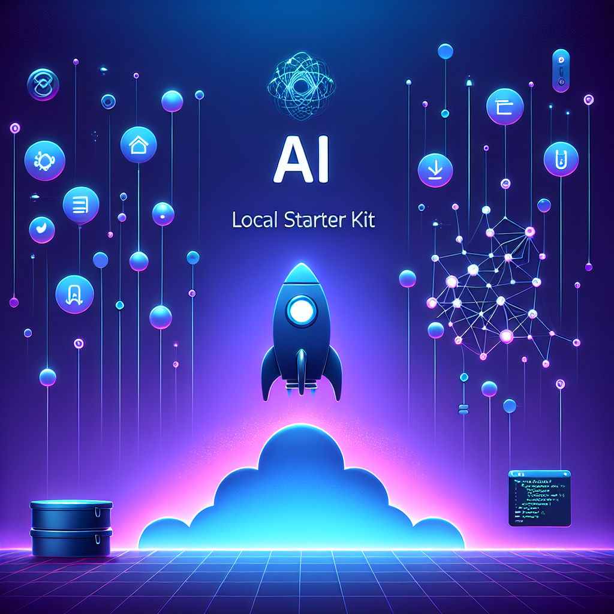

# 🚀 AI Local Starter Kit



[](README.md)

> 🌟 Un entorno de desarrollo local completo para aplicaciones de inteligencia artificial, con múltiples servicios preconfigurados para crear, gestionar y desplegar soluciones de IA.

## 📝 Descripción

AI Local Starter Kit proporciona un conjunto de herramientas y servicios de IA configurados para funcionar juntos en un entorno local mediante Docker Compose. Este kit facilita el desarrollo, prueba e implementación de aplicaciones de IA sin necesidad de depender exclusivamente de servicios en la nube.

## 🧩 Componentes

El kit incluye los siguientes servicios:

### 🖥️ Interfaces y Herramientas de Desarrollo

- **🔄 Flowise** (Puerto 3001): Herramienta no-code/low-code para construir agentes de IA y flujos de trabajo.
- **🌐 OpenWebUI** (Puerto 3000): Interfaz web para interactuar con modelos de IA.
- **⚙️ n8n** (Puerto 5678): Plataforma de automatización de flujos de trabajo.

### 🧠 Infraestructura de IA

- **🔌 LiteLLM** (Puerto 4000): Proxy que simplifica la conexión con diferentes modelos de IA.
- **💻 MCPO** (Puerto 8000): Proxy que permite acceder a servidores MCP a través de una API REST estándar, haciendo que tus herramientas funcionen con agentes LLM y aplicaciones que esperan servidores OpenAPI.
- **📄 Docling** (Puerto 5001): Sistema de gestión de documentos optimizado para IA.
- **🔊 Kokoro-TTS** (Puerto 8880): Servicio de conversión de texto a voz (Text-to-Speech) optimizado para funcionamiento local.

### 🗄️ Bases de Datos y Servicios de Soporte

- **💾 PostgreSQL para LiteLLM** (Puerto 5432): Base de datos para LiteLLM.
- **💾 PostgreSQL para n8n** (Puerto 5433): Base de datos para n8n.
- **📊 Prometheus** (Puerto 9090): Sistema de monitoreo y alertas.
- **🔄 Watchtower**: Servicio para actualizaciones automáticas de contenedores.

## 📋 Requisitos

- 🐳 Docker y Docker Compose
- 📥 Git (para clonar el repositorio)
- 💻 Al menos 8GB de RAM disponible (recomendado 16GB+)
- 💽 Espacio en disco para los contenedores y volúmenes

## ⚙️ Configuración

### 1️⃣ Clonar e Iniciar

1. Clone el repositorio:
   ```bash
   git clone https://mesquidar/ai-local-starter-kit.git
   cd ai-local-starter-kit
   ```

2. Edite el archivo `.env` con sus configuraciones personalizadas.

### 2️⃣ Configuración de Modelos de IA

#### 🔑 Configurar API Keys en LiteLLM

Antes de iniciar los servicios, es **crucial** configurar las API Keys de los modelos de IA que desea utilizar. Existen dos formas de hacerlo:

1. **Desde la interfaz web**: Una vez que LiteLLM esté en funcionamiento, puede añadir sus API keys directamente desde la interfaz web.

2. **Usando el archivo de configuración**: Edite el archivo `configs/litellm/litellm_config.yaml` para agregar sus claves API:
   ```yaml
   # Ejemplo para OpenAI
   model_list:
   - model_name: o3-mini
     litellm_params:
       model: openai/o3-mini
       api_key: sk-xxxxxxxxxxxxxxxxxxxxxxxx
 
   - model_name: gpt-4o
     litellm_params:
       model: openai/gpt-4o
       api_key: sk-xxxxxxxxxxxxxxxxxxxxxxxx
   
     # Agregar otros modelos según sea necesario
   ```

#### 🔧 Configurar MCPO

El servicio MCPO fallará si no se configura correctamente:

1. Modifique el archivo `configs/mcpo/config.json` con la configuración adecuada para su hardware:
   ```json
   {
      "mcpServers": {
        "playwright": {
          "url": "http://192.168.1.2:12345/sse"
          ]
        }
      }
    }
   ```

#### 🖥️ Utilizar Modelos Locales con LM Studio

Para utilizar modelos locales alojados en LM Studio:

1. Instale y configure [LM Studio](https://lmstudio.ai/) en su máquina local
2. Inicie un servidor local en LM Studio con su modelo preferido
3. En OpenWebUI, agregue una nueva conexión que apunte a LM Studio:
   - Vaya a Configuración > Conexiones
   - Agregue una nueva conexión con:
     - Nombre: "LM Studio Local"
     - URL base: "http://localhost:1234/v1" (o el puerto que haya configurado)
     - API Key: Según la configuración en LM Studio

### 3️⃣ Iniciar los Servicios

Una vez completada la configuración, inicie los servicios:

```bash
docker-compose -p AI-Local-Starter-Kit up -d
```

Para verificar que todos los servicios estén funcionando correctamente:

```bash
docker-compose ps
```

## 🚪 Acceso a los Servicios

Una vez iniciados los servicios, puede acceder a ellos a través de los siguientes URL:

- 🔄 **Flowise**: [http://localhost:3001](http://localhost:3001)
- 🌐 **OpenWebUI**: [http://localhost:3000](http://localhost:3000)
- ⚙️ **n8n**: [http://localhost:5678](http://localhost:5678)
- 🔌 **LiteLLM API**: [http://localhost:4000](http://localhost:4000)
- 💻 **MCPO**: [http://localhost:8000](http://localhost:8000)
- 📄 **Docling**: [http://localhost:5001](http://localhost:5001)
- 🔊 **Kokoro-TTS**: [http://localhost:8880](http://localhost:8880)
- 📊 **Prometheus**: [http://localhost:9090](http://localhost:9090)

## 📂 Estructura de Directorios

```
ai-local-starter-kit/
├── configs/                # Configuraciones para los servicios
│   ├── litellm/            # Configuración de LiteLLM
│   ├── mcpo/               # Configuración de MCPO
│   └── openwebui/          # Configuración de OpenWebUI
├── docker-compose.yml      # Definición de servicios
└── .env                    # Variables de entorno
```

## 🛠️ Personalización

Para personalizar cualquiera de los servicios, puede modificar los archivos de configuración correspondientes en el directorio `configs/`.

## ❓ Solución de Problemas

Si encuentra problemas con alguno de los servicios, puede revisar los logs con:

```bash
docker-compose logs [nombre-del-servicio]
```

### Problemas Comunes

1. **🔴 MCPO no inicia**: Verifique que la configuración del modelo sea correcta en `configs/mcpo/config.json`.
2. **🔴 LiteLLM no puede conectarse a modelos**: Confirme que las API keys sean correctas en la configuración.
3. **🔴 Falta de memoria**: Algunos modelos requieren más RAM. Ajuste la asignación de memoria en Docker Desktop.

## 👥 Contribuir

Las contribuciones son bienvenidas. Por favor, envíe un Pull Request o abra un Issue para discutir los cambios propuestos.


